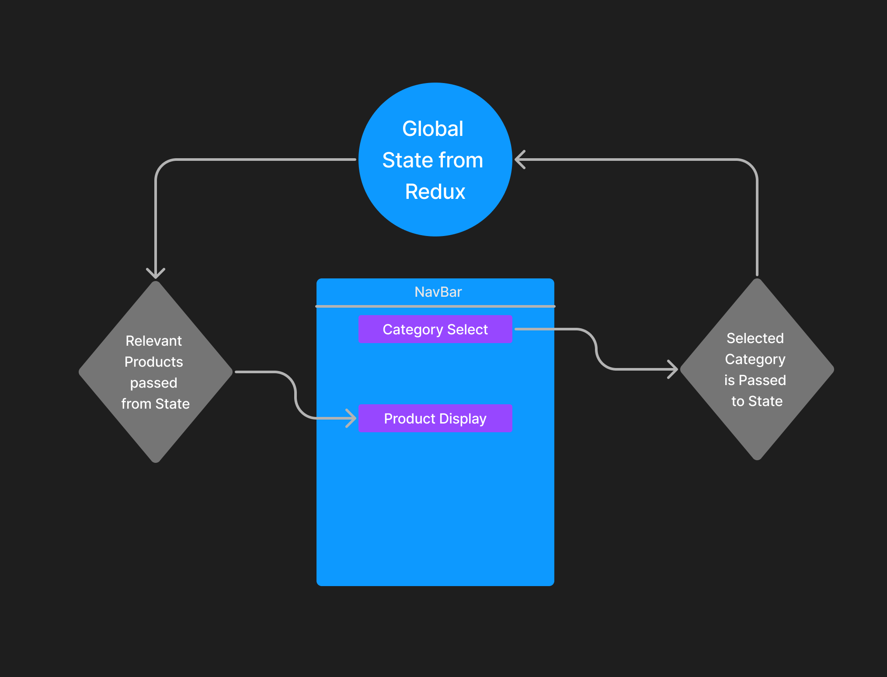

# storefront (Lab 36)

## Project: State Management with Redux

### Author: Tyler Bennett

### Problem Domain  

Making a digital storefront as a front to learn about redux stores. Display products by category once selected by user. 

### Links and Resources

- [ci/cd](https://github.com/tyler-bennett52/storefront/actions) (GitHub Actions)
- [Sandbox (main)](https://kfit7r-3000.csb.app/)
- [Sandbox (redux/class-36)](https://ox6hgc-3000.csb.app/)

### Setup

#### How to initialize/run your application (where applicable)

- npm i to install dependencies
- npm start to open page
- alternatively access the app at this url <https://kfit7r-3000.csb.app/>

#### Features / Routes

Day 1 - Can click any of the 3 categories to display mock products (featuring placeholder images from https://placehold.co/)

#### Tests

npm test to run tests

Day 1 - Testing of Product and Category interactivity.

#### UML

Day 1 UML

#### Attribution

Relied on class demo for structure of Redux features, especially reducer.js. ChatGPT showed me how to test Redux components. Placehold.co for placeholder images.
