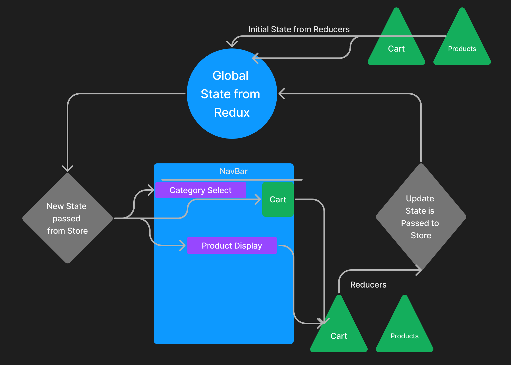

# storefront (Lab 36)

## Project: State Management with Redux

### Author: Tyler Bennett

### Problem Domain  

Making a digital storefront as a front to learn about redux stores. Display products by category once selected by user.

### Links and Resources

- [ci/cd](https://github.com/tyler-bennett52/storefront/actions) (GitHub Actions)
- [Sandbox (main)](https://kfit7r-3000.csb.app/)
- [Sandbox (redux/class-36)](https://ox6hgc-3000.csb.app/)
- [Sandbox (combined-reducers/class-37)](https://y50g6c-3000.csb.app/)
- [Sandbox (thunk/class-38)](https://4oisv4-3000.csb.app/)
- [Sandbox (rtx/class-39)](https://ijqrez-3000.csb.app/)

### Setup

#### How to initialize/run your application (where applicable)

- npm i to install dependencies
- npm start to open page
- alternatively access the app at this url <https://kfit7r-3000.csb.app/>

#### Features / Routes

Day 1 - Can click any of the 3 categories to display mock products (featuring placeholder images from https://placehold.co/)

Day 2 - Added functionality to add to cart button. Cart displays in upper right corner as items are added, X icon is functional for removing one item at a time.

Day 3 - Hooked up to API for live data.

Day 4 - Add Checkout and Details pages. Refactor to redux toolkit.

#### Tests

npm test to run tests

Day 1 - Testing of Product and Category interactivity, specifically whether category select works and if correct products are shown.

Day 2 - Integrate SimpleCart into integration test. Remove empty test files. Rewrite of Product.test.js.

Day 3 - Moved away from integration test and back to unit tests. Do not know why but couldn't get API call or MSW to work.

Day 4 - Expanded unit test to Checkout Page.

#### UML

Day 1 UML

Day 2 UML

#### Attribution

Relied on class demo for structure of Redux features, especially reducer.js. ChatGPT showed me how to test Redux components using the renderWithRedux function. Placehold.co for placeholder images.

Used ChatGPT to assist in writing unit tests and implementing MUI grid for checkout form.
